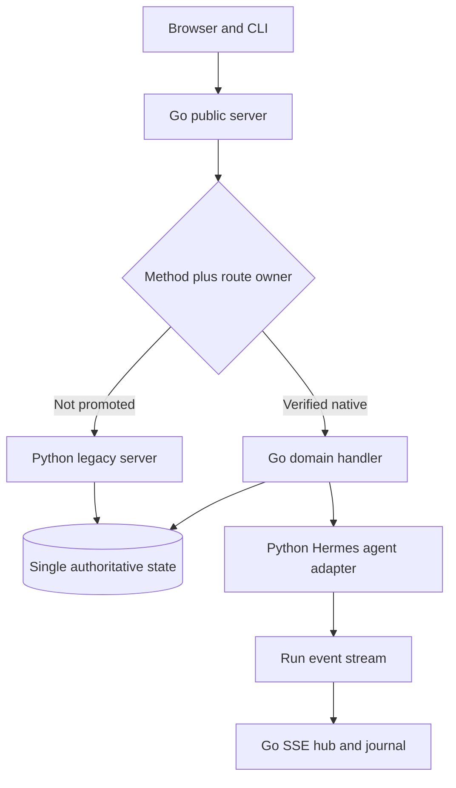

# Hermes Web Go: MVP Parity Audit and Migration Blueprint

**Repository:** `adityahimaone/hermes-web-go`  
**Audited revision:** `ba700f8ea73a688900b1ae2630ef5dffdb0d78bb` (`main`)  
**Audit date:** 2026-09-03  
**Scope:** Static comparison of the checked-in Python implementation, Go implementation, frontend route references, tests, and every document in `/docs`.

> **Verdict:** The repository contains a credible Go-front strangler and a partially migrated backend, but it does **not** yet demonstrate strict Python parity. The repository's own endpoint inventory reports 229 exact Python API paths, 40 Go-native paths, and 189 paths not yet native. Dynamic routes, notably Kanban task routes, make that 229 count an undercount. More importantly, several of the 40 native routes differ from Python in JSON shape, status codes, side effects, concurrency semantics, or live data ownership.

## Documentation Baseline

All 15 files currently present in `/docs` were reviewed. Their intended architecture and notable qualifications are:

| Document | Architectural guidance | Audit note |
|---|---|---|
| `01-architecture-design.md` | Go is the sole public server; use a strangler proxy; keep the frontend unchanged; delegate Hermes agent execution to Python; use explicit route ownership and pure-Go SQLite. | Sound target architecture. The live-data ownership transition is not complete. |
| `02-api-parity-mapping.md` | Defines representative endpoint, SSE, approval, upload, and auth behavior. | Explicitly partial; it cannot serve as the exhaustive contract source. |
| `03-mvp-scope.md` | Defines the MVP as Phase 1 proxy plus eight Phase 2 read-only routes. | Under this definition the MVP is small; it is not equivalent to full backend parity. |
| `04-task-breakdown.md` | Phase-by-phase migration checklist. | Completion markers are ahead of the evidence supplied by differential fixtures. |
| `05-migration-strategy.md` | Route-family cutovers, golden tests, rollback, observability, and operational sequencing. | Correct high-level playbook; route-level proof is incomplete. |
| `06-testing-and-parity.md` | Golden, differential, SSE, race, soak, and browser testing strategy. | The checked-in golden journey covers only three GET requests. |
| `07-future-vite-frontend.md` | Defers frontend modernization until backend parity. | Correctly keeps the current frontend as the consumer contract. |
| `08-kanban-board.md` | Describes Kanban behavior as inferred/unverified. | Stale: `api/kanban_bridge.py` contains the authoritative dynamic dispatcher and must be inventoried. |
| `09-phase-4b-blocking.md` | Records Phase 4B blockers and points to a superseding document. | The referenced authoritative unblock document is not in the audited tree. |
| `10-endpoint-migration-inventory.md` | Reports 229 Python paths, 40 Go-native paths, and 189 not migrated. | Best current exact-path inventory, but dynamic-prefix dispatch is collapsed. |
| `chat_api_parity.md` | Describes chat behavior and historical parity issues. | Some conclusions are too optimistic; active-stream, SSE replay/fan-out, history, and persistence still differ. |
| `phase-0-fresh-lifecycle-plan.md` | Defines a controlled baseline lifecycle and artifact collection. | Useful methodology; the committed journey remains intentionally small. |
| `phase-1-implementation-plan.md` | Adds Go-front proxy and shadow comparison. | Architecture is present. Contract coverage is not exhaustive. |
| `phase-2-implementation-plan.md` | Ports bounded read-only handlers with fallback. | Several native handlers are not exact Python replicas. |
| `plan.md` | Master phase plan and status notes. | Contains internally stale status rows and should be regenerated from evidence. |

The authoritative principles that should survive the migration are:

1. Go is the only browser-facing server.
2. A route remains Python-owned until its entire observable contract has passed differential tests.
3. The frontend is not changed to accommodate Go until backend parity is complete.
4. Hermes agent execution remains delegated; Go owns HTTP/SSE orchestration, not the Python `AIAgent` internals.
5. Route ownership is explicit, reversible, and promoted by evidence.
6. A response contract includes status, headers, bytes/JSON shape, omitted-vs-null fields, side effects, ordering, timing-sensitive state, and concurrency behavior.

# 1. Design & Architecture Strategy

## 1.1 Define the actual MVP

The documents use “MVP” to mean only the proxy plus a small read-only slice. The requested goal is broader. Use two explicit milestones:

- **Frontend-complete MVP:** Every route used by the checked-in frontend is available through Go, either as a verified native handler or a transparent Python proxy. No frontend change is required.
- **Full native parity:** Every Python route, including dynamic dispatch routes and operational endpoints, is Go-owned or is explicitly retained as a documented Python agent boundary.

Do not declare full native parity from a route count. Declare it from contract fixtures and state-transition tests.

## 1.2 Recommended target topology



The key constraint is **one authoritative state owner per domain**. The current boot-time import from Hermes `state.db` or JSON into `webui.db` is a migration seed, not synchronization. If Go reads its copy while proxied Python mutations write another store, responses become stale even when both handlers are individually correct.

Use one of these transitions per domain:

1. **Python-authoritative bridge:** Go-native reads call a Python repository/bridge until Go owns all mutations for that domain. This is safest during the strangler phase.
2. **Shared store with proven schema:** Both runtimes use the same database and transaction rules. Only use this after locking semantics, timestamps, nullability, and migrations are proven compatible.
3. **Atomic domain cutover:** Seed once while writes are paused, switch all reads and writes for the route family to Go, then never dual-write.

Avoid ongoing best-effort dual writes. They create an untestable reconciliation problem and obscure which response is authoritative.

## 1.3 Route ownership must be method-aware and readiness-aware

The current static, path-only `NativeRoutes` registry is not sufficient. Ownership must be keyed by HTTP method plus normalized route pattern and must include a readiness check. If a native dependency is unavailable, the route must fall through to Python instead of returning a new Go-specific `503`, unless Python also returns that exact response.

```go
package routing

type Key struct {
	Method  string
	Pattern string
}

type Owner interface {
	Ready() bool
	ServeHTTP(http.ResponseWriter, *http.Request)
}

type Registry struct {
	routes map[Key]Owner
}

func (r *Registry) Resolve(method, path string) (Owner, bool) {
	key, ok := matchRegisteredPattern(method, path)
	if !ok {
		return nil, false
	}
	owner := r.routes[key]
	return owner, owner != nil && owner.Ready()
}
```

## 1.4 Treat Python JSON as a wire protocol

Do not reuse storage structs as API DTOs. Python's dynamic dictionaries encode distinctions Go easily loses:

- absent key vs key with `null`;
- JSON boolean vs `0`/`1`;
- integer vs floating-point number;
- empty array vs `null`;
- insertion/order-sensitive event sequences;
- heterogeneous `message.content` and `result` objects;
- unknown extension fields that the frontend may pass through.

Use dedicated wire types, pointers for optional scalar fields, `json.RawMessage` for intentionally heterogeneous values, and custom `MarshalJSON` only where the Python contract demands conditional fields. Never add `omitempty` merely to make Go output smaller.

```go
type Optional[T any] struct {
	Present bool
	Value   T
}

type PythonNumber json.Number

type MessageDTO struct {
	Role       string          `json:"role"`
	Content    json.RawMessage `json:"content"`
	ToolCalls  json.RawMessage `json:"tool_calls,omitempty"`
	Timestamp  *float64        `json:"timestamp,omitempty"`
	Extra      map[string]json.RawMessage `json:"-"`
}
```

Where arbitrary unknown fields are part of the contract, preserve them explicitly rather than decoding and re-encoding through a narrower Go struct.

## 1.5 Agent and streaming boundary

Go should own stream lifecycle, authorization, fan-out, reconnect/replay, and frontend formatting. Python should continue to own Hermes agent semantics until a separately scoped agent port exists.

Required request fields at the Go→Python boundary include the Python task/run identity, session ID, normalized history, attachments, workspace, provider, model, source, and any profile/personality/toolset context. The current HTTP client omits `task_id` and history.

The SSE implementation must be a journaled broadcast hub, not one channel consumed competitively by multiple listeners:

```go
type Event struct {
	Seq   uint64
	Name  string
	Data  json.RawMessage
	At    time.Time
}

type Stream struct {
	mu          sync.RWMutex
	events      []Event
	subscribers map[uint64]chan Event
	terminal    bool
}

func (s *Stream) Subscribe(after uint64) (replay []Event, live <-chan Event, cancel func())
func (s *Stream) Publish(name string, data json.RawMessage) Event
func (s *Stream) Finish(name string, data json.RawMessage)
```

Persist enough of the event journal to reproduce Python reconnect behavior (`Last-Event-ID`, cursor/sequence replay, terminal-event recovery), and expire completed streams with a bounded retention policy.

## 1.6 Error handling

There is no single universal Python error envelope. Preserve errors per endpoint:

- exact HTTP status;
- exact JSON keys and conditional detail fields;
- whether the body is JSON, text, empty, or streamed;
- `Content-Type`, `Content-Disposition`, cache and security headers;
- whether validation stops before or after a side effect;
- whether dependency failure is proxied, retried, or returned.

Do not return raw Go error strings from HTTP or SSE. Map internal errors to Python-compatible public messages and log the causal error with a correlation/run ID.

# 2. Current State & Gap Analysis

## 2.1 Quantitative state

| Measure | Audited result |
|---|---:|
| Python API modules | 68 files under `api/` |
| Approximate Python API LOC | 109,401 |
| Approximate non-test Go LOC (`cmd` + `internal`) | 5,444 |
| Go test functions | 115 |
| Python exact API paths reported by inventory | 229 |
| Go-native exact API paths reported by inventory | 40 |
| Exact paths reported not native | 189 |
| Static frontend `/api/*` literals | 167 |
| Committed golden journey requests | 3 (`/health`, `/api/sessions`, `/api/workspaces`) |

The environment used for this audit did not contain a Go toolchain, so `go test` could not be executed. The findings below are from source, test, route, and documentation analysis; they are not a claim that existing tests fail.

## 2.2 What is mapped today

| Domain | Python implementation | Current Go implementation | State |
|---|---|---|---|
| Public server/router | `server.py`, `api/routes.py` | `cmd/server`, `internal/httpserver` | Go front door exists. |
| Legacy fallback | Python route dispatcher | `internal/proxy` | Present, but ownership/fallback semantics need correction. |
| Sessions | `api/models.py`, session routes in `api/routes.py` | `internal/session`, `internal/store` | Partial; DTOs, lifecycle, timestamps, metrics, and cleanup differ. |
| Workspace/files | `api/workspace.py`, `api/upload.py`, route helpers | `internal/workspace`, `internal/httpserver` | Partial; result shapes, limits, raw-file security, and recursive behavior differ. |
| Chat/agent | route logic plus Hermes `AIAgent` runtime | `internal/agent`, `internal/stream`, HTTP handlers | Structural shell only; request context and stream semantics are incomplete. |
| Approvals | pending callback/gateway logic in Python | `internal/approval` | UI queue exists; execution resume/deny integration is incomplete. |
| Cron | Python cron gateway and local behavior | `internal/cron` | Partial; dependency fallback and exact gateway response mapping differ. |
| Skills/memory | Python profile-aware readers and routes | `internal/skills`, `internal/memory` | Read-only subset with query/shape differences. |
| Auth | password, OIDC, trusted auth, passkeys, rate limits | `internal/auth` | Password-only subset with incompatible status shape. |
| Kanban | `api/kanban_bridge.py` | None | Not migrated; dynamic route inventory is incomplete. |
| Terminal, projects, profiles, providers, settings, media, extensions | Multiple Python modules | None or proxy only | Not migrated. |

## 2.3 High-severity parity defects in currently native behavior

### State ownership

- Go opens `webui.db` and performs a boot-time import from Python state. Python continues to serve proxied routes against its own live stores and sidecars.
- There is no general ongoing synchronization or atomic per-domain cutover.
- A Go-native read can therefore disagree with a proxied Python write even when both requests return 200.

### Proxy and ownership

- The native route registry is path-only and lists fewer paths than the router actually registers.
- Cron mutation handlers may return Go `503` when the mutator is unavailable instead of falling through to Python.
- Skills and memory handlers are always registered even when their behavior is only a subset.
- Ownership should be `(method, pattern, readiness, contract_version)`, with Python fallback until promotion.

### Health

Python `/health` exposes `status`, `sessions`, `active_streams`, `active_runs`, `runs`, `last_run_finished_at`, `server_started_at`, floating `uptime_seconds`, `accept_loop`, optional idle/age fields, and deep checks; it can return `503` when degraded. Go returns only `status`, `active_streams`, and integer `uptime_seconds`, always with 200.

### Session reads and mutations

- Python's compact session projection has more than 50 observable fields. Go returns a small storage projection and an extra `rev`.
- Python `message_count` counts all messages and separately exposes `user_message_count`; Go currently counts only user messages.
- Python applies public redaction and overlays runtime/pending-stream state; Go does not reproduce that projection.
- `/api/sessions` profile, archive, source, CLI/messaging/Kanban, paging, visibility, and count semantics are incomplete.
- `/api/sessions/search` lacks Python `depth`, profile/redaction, and normalized content search behavior.
- Go session creation accepts fields Python does not and omits Python profile/project/provider/worktree/toolset/memory behavior.
- Go session update decodes `pinned`/`archived` as integer pointers; JSON booleans can be mishandled.
- Python deletion cleans sidecars, attachments, state DB rows, journals, terminals, and worktrees and reports partial cleanup. Go deletes only its local row.

### Workspace and files

- Python `/api/workspaces` returns persisted `last` plus `terminal_remote_backend`; Go derives last from the first row and omits the terminal field.
- Python workspace mutations return the complete updated workspace list; Go returns smaller ad-hoc objects.
- Python text file cap is exactly `400_000` bytes (`api/config.py`); Go uses 5 MiB.
- Python upload default is 20 MiB with `HERMES_WEBUI_MAX_UPLOAD_MB`; Go's upload setting should be checked against every upload branch, archive extraction cap, and response shape.
- Python raw-file responses support download/inline choices, safe disposition, MIME protection, CSP sandboxing, and unrestricted legitimate large-file streaming; Go applies the text-read cap and lacks equivalent security behavior.
- `/api/file/save` omits Python's returned `size` and Office-file rules.
- `/api/file/create` status and normalized-path behavior differ.
- Python file delete supports explicit recursive directory removal; Go rejects directories.
- Python session export supports JSON and HTML, themes, redaction, full session content, and a session-specific filename; Go exposes only a simplified JSON export.

### Chat and SSE

- Python `/api/chat/start` returns stream/session/turn IDs, pending timestamp, title, and sometimes effective model/provider. Go returns only IDs.
- Python rejects overlapping active runs for a session with a typed `409`; Go has no equivalent guard.
- The Go HTTP runner payload omits `task_id` and normalized history, despite the Python flow depending on them.
- The Go handler does not populate full history, provider, attachments, profile/personality/toolset, journal, or pending state.
- The synchronous Go path does not persist the assistant response with Python-equivalent result metadata.
- Python supports multiple SSE subscribers, ordered IDs, replay, run journals, reconnect cursors, heartbeats, and terminal recovery. Go uses one channel per stream, so subscribers compete rather than receive a broadcast; it has no replay and retains closed streams.
- `/api/chat/cancel`, steering, clarify, reasoning, subscription, and session-event routes remain Python-only.

### Approvals

- Go can list and mark a pending approval, but responding updates only its local queue/allowlist.
- Python invokes the pending tool callback or gateway response, validates run/mirror tokens, handles stale cards and yolo rules, and resumes or denies execution.
- Until callback/gateway resolution is implemented, Go-native approval response is not functionally equivalent.

### Cron, skills, memory, and auth

- Cron gateway mutations can collapse upstream failures into `{\"ok\": true}` and do not preserve exact status/body behavior.
- Skills ignores category/profile filters; content does not reproduce linked-file behavior.
- Memory lacks the full profile/project context and redaction flags.
- Python auth status exposes auth/login/OIDC/passwordless/passkey/trusted-user fields; Go returns only `{\"enabled\": bool}`.
- Go auth is constructed only for a plaintext password path. It does not implement Python password hash/config behavior, logout, OIDC, passkeys, trusted auth, CSRF/rate limiting, or the complete secure-cookie decision.

## 2.4 Inventory defects and missing route families

The 229-path figure is useful but not exhaustive because literal scanners cannot expand dynamic dispatch. `api/kanban_bridge.py`, for example, contains:

- `GET /api/kanban/boards`, `/board`, `/config`, `/stats`, `/assignees`, `/events`, `/events/stream`, `/tasks/{id}/health`, `/tasks/{id}/log`, `/tasks/{id}`
- `POST /api/kanban/boards`, `/boards/{slug}/switch`, `/dispatch`, `/tasks/bulk`, `/tasks`, `/links`, `/links/delete`, `/tasks/{id}/comments`, `/tasks/{id}/block`, `/unblock`, `/reclaim`, `/pause`, `/patch`
- `PATCH /api/kanban/config`, `/boards/{slug}`, `/tasks/{id}`
- `DELETE /api/kanban/boards/{slug}`, `/links`

The exact-path backlog in `docs/10-endpoint-migration-inventory.md` also spans:

| Family | Representative missing behavior |
|---|---|
| Chat/agent | cancel, steer, clarify, reasoning content/management, subscriptions, files, session events |
| Session lifecycle | archive, restore, pin, move, clear, import, share, drafts, compress, resume, send-input, process state |
| Git/file | status, diff, commit, branches, checkout, pull/push, init; rename/move/reveal/path/open; image/video/raw helpers |
| Identity/auth | logout, OIDC, passkeys, trusted-auth and user-management routes |
| Cron | status, availability, reload, webhook/integration behavior |
| Skills | install, delete, copy, import, rescan, diagnostics, categories, project scoping |
| Models/providers/settings | model catalog, provider detection/config, API keys, defaults, reasoning effort, settings persistence |
| Terminal/background/dashboard | terminal lifecycle and streams, background processes, dashboard layout and system information |
| Projects/workspaces | project lifecycle, project memory/context, workspace defaults and discovery |
| Notes/knowledge/wiki | CRUD, search, indexing, linking, export and streaming/search behavior |
| Escape/rollback | browse/read/write/status routes and rollback snapshots |
| Media | snapshots, image/video generation, transcription, TTS, attachments |
| Gateway/health/updates | gateway status/restart/config, update checks, diagnostics and usage |
| Extensions/MCP | catalog, configuration, lifecycle and OAuth/resource behavior |
| Kanban | boards, tasks, dispatch, event streams, comments, links, health and logs |

Two static frontend literals, `/api/config` and `/api/personality/clear`, do not appear as exact Python routes and should be classified as stale consumer references, aliases, or scanner false positives before implementation.

# 3. Migration Blueprint (1:1 Parity Plan)

## Phase A — Freeze and inventory the contract

1. Record the Python reference SHA, dependency lock, environment variables, fixture state, timezone, and frontend SHA.
2. Replace the literal-only route scan with a dispatcher-aware inventory that records `(method, pattern, source location, guard, auth policy)`.
3. Add explicit extraction for prefix/dynamic routers such as Kanban, MCP, and terminal routes.
4. Cross-reference routes from three sources: Python dispatcher, Go router, and frontend literals.
5. Fail CI when an endpoint is added, removed, or changes owner without a contract-ledger update.

**Exit gate:** every route is classified as `python-owned`, `go-shadow`, `go-native`, `intentional-agent-boundary`, `deprecated`, or `stale-frontend-reference`.

## Phase B — Build the executable contract corpus

1. Start Python and Go-front instances from isolated but identical fixture state.
2. Stub nondeterministic external providers and the agent at the transport boundary.
3. Record request, response status, ordered headers, raw body, parsed JSON type tree, and post-request state for every branch.
4. Store one fixture per success, validation error, not-found, conflict, unauthorized, forbidden, dependency failure, and relevant query variant.
5. For streaming routes, store exact SSE frames, event IDs, heartbeats, terminal behavior, reconnect/replay sequence, and subscriber behavior.
6. Only mask explicitly declared volatile fields such as generated UUIDs and timestamps. Validate their type, format, monotonicity, and cross-field references before masking.

**Exit gate:** every frontend-referenced route has at least one success and all reachable frontend error branches captured; every Python route has a ledger entry.

## Phase C — Repair the strangler foundation

1. Replace the path-only native map with method-and-pattern ownership.
2. Add readiness-based proxy fallback; do not mount an incomplete native handler merely because its route exists.
3. Select and implement one state owner per domain. Until a complete mutation family is ported, prefer Python-authoritative reads over stale Go imports.
4. Centralize Python-compatible JSON, errors, cache/security headers, request size limits, and correlation IDs.
5. Add shadow execution only for side-effect-free reads, or execute mutations against disposable cloned state.

**Exit gate:** unpromoted routes transparently proxy; a missing Go dependency never invents a response that Python would not return; state cannot diverge across mixed ownership.

## Phase D — Fix the routes already called native

Order matters because later domains depend on earlier ones:

1. `/health` and diagnostic semantics.
2. Session DTO/projection, list/search filters, timestamps, redaction, counts, runtime overlay.
3. Workspace list/mutations and single state ownership.
4. File read/raw/save/create/delete/export/upload limits, headers, security, and result shapes.
5. Chat request construction, same-session exclusion, pending state, persistence, and errors.
6. Journaled SSE fan-out/replay and stream cleanup.
7. Approval callback/gateway completion semantics.
8. Cron upstream status/body preservation and fallback.
9. Skills and memory query/shape parity.
10. Auth status/login compatibility or route fallback until the full auth family is ready.

**Exit gate:** each promoted route passes byte/status/header comparison and state-transition tests for all ledger cases.

## Phase E — Port by cohesive route family

Recommended frontend-value order:

1. Session lifecycle, drafts, reasoning, cancel/steer, and events.
2. Models, providers, profiles, settings, API keys, and configuration.
3. Complete files, Git, projects, and workspace behavior.
4. Terminal, background processes, and dashboard.
5. Cron, skills, memory, notes, knowledge, and wiki.
6. Kanban including dynamic routes and event streams.
7. Media, transcription/TTS, extensions/MCP, gateway, updates, escape/rollback.
8. Full identity/auth only as one security boundary; do not split related login/session/logout protections across runtimes.

For each family: capture → implement DTO/repository/service/handler → differential test → browser test → soak/race test → promote → retain one-release rollback switch.

## Phase F — Cutover and removal gates

A route may become Go-native only when:

- all contract cases match status, headers, raw/JSON body, and side effects;
- absent/null/empty and JSON number/boolean types match;
- concurrent and retry behavior matches;
- authorization, traversal, CSRF, rate limit, and redaction behavior matches;
- frontend E2E passes without compatibility changes;
- rollback to Python is tested.

Remove the Python proxy only when every inventory route is promoted or explicitly retained as the Hermes agent boundary, production telemetry shows no fallback for the agreed soak window, and the rollback plan has been exercised.

# 4. Comprehensive Documentation Template (`.md`)

The following is the required structure for the living parity specification. It is designed to be generated partly from source inventory and partly from captured Python fixtures. **Do not guess unknown schemas from names or documentation prose.** A contract is marked complete only after a Python fixture proves it.

## 4.1 Document control

```md
# Hermes Python-to-Go Parity Specification

- Python reference SHA:
- Go candidate SHA:
- Frontend SHA:
- Contract corpus version:
- Fixture database/archive SHA-256:
- Python/Go versions:
- OS and architecture:
- Timezone/locale:
- Environment manifest (secrets redacted):
- Generated at:
- Owners/reviewers:
```

## 4.2 Architecture decisions

```md
## ADR-001: Public ingress and fallback
Decision: Go is the only public ingress; unpromoted routes proxy to Python.
Evidence:
Rollback:

## ADR-002: State ownership by domain
| Domain | Current owner | Target owner | Cutover rule | Reconciliation forbidden? |

## ADR-003: Hermes agent boundary
Transport:
Required request fields:
Event schema:
Timeout/cancel/retry behavior:

## ADR-004: JSON compatibility policy
Absent/null/empty policy:
Number policy:
Unknown-field policy:
Ordering policy:
Timestamp policy:
```

## 4.3 Function mapping

Populate source locations and symbols from the pinned SHA. Use one row per independently testable behavior, not just one row per file.

| Domain | Python module/function | Go package/type/function | Status | Required action |
|---|---|---|---|---|
| Routing | `server.py`; `api/routes.py` dispatcher | `cmd/server`; `internal/httpserver` | Partial | Make ownership method/pattern/readiness-aware. |
| Proxy | Python public handler as reference | `internal/proxy` | Partial | Preserve raw status/headers/body; add fallthrough tests. |
| Health | `api/routes.py::_handle_health` | `internal/httpserver` health handler | Drift | Implement full normal/deep/degraded contract. |
| Session projection | `api/models.py::Session.compact` and public projection helpers | `internal/session` DTO mapper | Drift | Port all conditional fields, redaction, metrics, and runtime overlay. |
| Session persistence | state DB and sidecar helpers | `internal/store` | Partial | Establish one authoritative store and equivalent transactions. |
| Session list/search | session route helpers in `api/routes.py` | `internal/httpserver` session handlers | Drift | Filters, paging, profiles, source, visibility, search depth. |
| Session lifecycle | new/update/delete/rename/archive/pin/move/import helpers | `internal/session` service | Mostly missing | Port cohesive lifecycle and cleanup side effects. |
| Workspace | `api/workspace.py` and route helpers | `internal/workspace` | Drift | Last workspace, terminal backend, mutation responses. |
| File read/raw | `_handle_file_read`, `_handle_file_raw`, `_serve_file_bytes` | workspace/file handlers | Drift | 400,000-byte text cap; raw security/disposition behavior. |
| File mutations | `_handle_file_save/create/delete/rename/move/...` | workspace/file service | Partial | Statuses, normalized paths, recursive behavior and response sizes. |
| Upload | `api/upload.py` handlers | Go upload handler | Partial | All modes, 20 MiB default, archive caps, media metadata, exact errors. |
| Export | Python session export helper | Go export handler | Drift | JSON/HTML, redaction, themes, filenames and complete DTO. |
| Chat start/sync | Python chat handlers | Go chat handlers and `internal/agent` | Drift | Full request context, overlap guard, persistence and result envelope. |
| Agent execution | Hermes `AIAgent` invocation | `internal/agent::Client` | Boundary | Keep delegated; send `task_id`, history, attachments and provider context. |
| Streams | Python stream registry/run journals | `internal/stream` | Drift | Broadcast, replay, IDs, reconnect, retention and terminal recovery. |
| Approval | Python pending callback/gateway helpers | `internal/approval` | Incomplete | Resolve actual execution, not only UI queue state. |
| Cron | Python cron gateway/routes | `internal/cron` | Partial | Exact status/body/error mapping and profile availability. |
| Skills | Python skill routes/readers | `internal/skills` | Partial | Category/profile/linked-file behavior; add mutations later. |
| Memory | Python memory/profile/project helpers | `internal/memory` | Partial | Profile/project fields and redaction. |
| Auth | Python auth/OIDC/passkey/trusted-auth modules | `internal/auth` | Major gap | Keep proxy-owned or port the whole security boundary. |
| Kanban | `api/kanban_bridge.py` | `internal/kanban` | Missing | Port dynamic dispatcher, storage, task lifecycle, events and logs. |
| Terminal | Python terminal modules | `internal/terminal` | Missing | PTY lifecycle, streams, resize, input, cleanup, authorization. |
| Git | Python Git helpers/routes | `internal/gitservice` | Missing | Preserve porcelain parsing, status codes and command safety. |
| Providers/settings | Python provider/model/config routes | `internal/settings`, `internal/providers` | Missing | Preserve secret redaction and dynamic schemas. |
| Notes/knowledge/wiki | corresponding Python modules | domain packages | Missing | Port CRUD/search/index/stream contracts. |
| Media/extensions/MCP | corresponding Python modules | domain packages | Missing | Port only after contract and security capture. |

## 4.4 Go skeleton for unmigrated components

```go
// internal/compat/value.go
package compat

type ErrorCase struct {
	Status  int
	Body    json.RawMessage
	Headers http.Header
}

func WriteRawJSON(w http.ResponseWriter, status int, body json.RawMessage, headers http.Header) {
	for k, values := range headers {
		for _, value := range values { w.Header().Add(k, value) }
	}
	w.WriteHeader(status)
	_, _ = w.Write(body)
}

// internal/agent/client.go
type TurnRequest struct {
	TaskID         string          `json:"task_id"`
	SessionID      string          `json:"session_id"`
	Message        json.RawMessage `json:"message"`
	History        json.RawMessage `json:"history"`
	Attachments    json.RawMessage `json:"attachments"`
	Workspace      string          `json:"workspace"`
	Provider       *string         `json:"provider"`
	Model          *string         `json:"model"`
	Source         *string         `json:"source"`
	Profile        *string         `json:"profile"`
	Personality    json.RawMessage `json:"personality"`
	EnabledToolsets json.RawMessage `json:"enabled_toolsets"`
}

type Client interface {
	Start(context.Context, TurnRequest, func(stream.Event) error) error
	Cancel(context.Context, string) error
	Steer(context.Context, string, json.RawMessage) error
}

// internal/approval/backend.go
type Resolution struct {
	ApprovalID string
	RunID      string
	Choice     string
	Always     bool
	MirrorToken *string
}

type Backend interface {
	Pending(context.Context, Visibility) ([]PendingDTO, error)
	Resolve(context.Context, Resolution) (json.RawMessage, int, error)
}

// internal/contract/handler.go
type Handler interface {
	Validate(*http.Request) *compat.ErrorCase
	Execute(context.Context, *http.Request) (status int, headers http.Header, body json.RawMessage, err error)
}

// internal/kanban/service.go
type Service interface {
	ListBoards(context.Context, ListBoardsRequest) (json.RawMessage, error)
	GetBoard(context.Context, GetBoardRequest) (json.RawMessage, error)
	CreateTask(context.Context, CreateTaskRequest) (json.RawMessage, error)
	PatchTask(context.Context, PatchTaskRequest) (json.RawMessage, error)
	DispatchTask(context.Context, DispatchTaskRequest) (json.RawMessage, error)
	Subscribe(context.Context, EventsRequest) (stream.Subscription, error)
}
```

The raw-message return types above are scaffolding for contract discovery. Replace them with typed DTOs only after the fixture corpus proves all variants; retain `json.RawMessage` for genuinely heterogeneous fields.

## 4.5 Strict API return value contracts

### Contract rules

1. JSON keys are case-sensitive and must match Python exactly.
2. “Missing”, `null`, `[]`, `{}`, `false`, `0`, `0.0`, and `""` are distinct values.
3. JSON numbers must preserve integer-vs-float expectations where raw output or JavaScript behavior observes them.
4. Array ordering must match Python unless the Python contract explicitly declares it unordered.
5. Unknown dynamic fields must be preserved or explicitly proved private.
6. HTTP status, `Content-Type`, cache headers, disposition, CSP, cookies, and SSE frame formatting are part of the contract.
7. Error cases are endpoint-specific; there is no invented global `{error, code}` standard.
8. Examples below illustrate known shapes but do not replace captured fixtures.

### Core schema: health

```json
{
  "$id": "contracts/health.response.schema.json",
  "type": "object",
  "required": ["status", "sessions", "active_streams", "active_runs", "runs", "server_started_at", "uptime_seconds", "accept_loop"],
  "properties": {
    "status": {"type": "string"},
    "sessions": {"type": "integer"},
    "active_streams": {"type": "integer"},
    "active_runs": {"type": "integer"},
    "runs": {"type": "integer"},
    "last_run_finished_at": {"type": ["number", "null"]},
    "server_started_at": {"type": "number"},
    "uptime_seconds": {"type": "number"},
    "accept_loop": {"type": "boolean"},
    "oldest_run_age_seconds": {"type": "number"},
    "idle_seconds_since_last_run": {"type": "number"},
    "checks": {"type": "object"}
  },
  "additionalProperties": true
}
```

Example normal payload (values are illustrative; fixture values govern):

```json
{
  "status": "ok",
  "sessions": 2,
  "active_streams": 0,
  "active_runs": 0,
  "runs": 3,
  "last_run_finished_at": 1756900000.125,
  "server_started_at": 1756899000.5,
  "uptime_seconds": 999.625,
  "accept_loop": true,
  "idle_seconds_since_last_run": 125.5
}
```

### Core schema: public compact session

The definitive `required` list and conditional presence matrix must be generated from `Session.compact()` plus public redaction fixtures. At minimum, capture these field groups:

```json
{
  "id": "session-id",
  "title": "New session",
  "workspace": "/absolute/workspace",
  "model": "provider/model",
  "model_provider": "provider",
  "messages": [],
  "message_count": 0,
  "user_message_count": 0,
  "last_message_at": null,
  "created_at": 1756900000.125,
  "updated_at": 1756900000.125,
  "pinned": false,
  "archived": false,
  "active": false,
  "pending": false,
  "source": "web",
  "read_only": false
}
```

The full schema must additionally cover profile, token/cost/cache metrics, personality, compression/context engine, routing, project/worktree, created-workspace, stream/pending fields, enabled toolsets, drafts, process wakeup/pause, sharing, and public redaction. Do not expose the Go-only `rev` field unless a Python fixture contains it.

### Native-route contract ledger

The following ledger names every currently registered native route and the exact contract work required. Each row must link to success/error JSON Schema files and golden examples before promotion.

| Method and endpoint | Success contract | Mandatory variants/errors |
|---|---|---|
| `GET /health` | Full health object above; 200 or degraded 503 | `deep`, active run, idle run, degraded check |
| `GET /api/session?id=` | `Session.compact()` public projection | missing id, unknown id, profile visibility |
| `GET /api/sessions` | `{sessions: Session[], ...profile/archive/source/count metadata}` exactly as fixture | empty, archived, profile/all_profiles, source, CLI/messaging/Kanban, paging |
| `GET /api/sessions/search` | Python search result object | empty query, depth, profile, redaction, limit, malformed query |
| `POST /api/session/new` | Python new-session object including resolved defaults | workspace/profile/project/model/provider/worktree/toolsets, invalid body |
| `POST /api/session/update` | Exact updated-session/result object | bool fields, workspace/model/provider, conflict, missing session |
| `POST /api/session/delete` | `{ok, state_db_cleanup_failed?, worktree_retained?, ...}` | active run, cleanup failure, unknown session |
| `POST /api/session/rename` | Python rename result | blank/long title, unknown session, title event/side effect |
| `GET /api/list` | directory entries and Python signature/trust/recovery metadata | traversal, missing directory, >200 entries, file-as-dir |
| `GET /api/file` | text file object with 400,000-byte cap | binary/Office, exactly at/over cap, traversal, missing |
| `GET /api/file/raw` | raw bytes with exact MIME/disposition/cache/CSP | `download=1`, `inline=1`, dangerous MIME, large file, missing |
| `POST /api/file/save` | `{ok:true,path:string,size:integer}` | Office, traversal, missing parent, invalid content |
| `POST /api/file/create` | Python normalized path result | existing file (Python status), directory mode, invalid name |
| `POST /api/file/delete` | Python file/directory result | recursive true/false, missing, traversal, protected path |
| `POST /api/upload` | mode-specific upload/attachment result | 20 MiB cap, zero/unknown length, archive bomb/path, duplicate, media metadata |
| `GET /api/session/export` | JSON or HTML bytes; session-specific filename | `format=json`, `format=html`, theme/palette, redaction, missing session |
| `POST /api/chat/start` | `{stream_id,session_id,pending_started_at,turn_id,title,effective_model?,effective_model_provider?}` | active-session 409, invalid attachment/model/provider, runner unavailable |
| `POST /api/chat` | Python synchronous result/session envelope | same validation as start, assistant persistence, agent error |
| `GET /api/chat/stream` | Ordered SSE frames with IDs/replay/heartbeat/terminal | reconnect, second subscriber, dead stream, unauthorized/profile-hidden |
| `GET /api/chat/stream/status` | live/dead/replay/journal status object | unknown stream, replay available, terminal stream |
| `GET /api/approval/pending` | `{pending: Approval[],pending_count:integer}` | visibility/profile, empty, stale/mirrored approval |
| `POST /api/approval/respond` | Python callback/gateway result | allow once/always/deny, stale, bad mirror token, gateway failure |
| `GET /api/workspaces` | `{workspaces:[...],last:string|null,terminal_remote_backend:...}` | empty, invalid stored last, profile-specific state |
| `POST /api/workspaces/add` | full updated Python workspace payload | duplicate, missing path, permission/trust failure |
| `POST /api/workspaces/remove` | full updated Python workspace payload | last/default removal, missing path |
| `POST /api/workspaces/rename` | full updated Python workspace payload | duplicate label, missing path, invalid name |
| `GET /api/crons` | profile-aware cron list/status object | unavailable backend, malformed file, empty |
| `GET /api/crons/output` | exact output object/bytes and cursor behavior | missing job/run, truncation, unavailable |
| `POST /api/crons/create` | upstream Python status and object unchanged | validation, conflict, upstream 4xx/5xx |
| `POST /api/crons/run` | upstream Python status/result unchanged | running, missing, upstream failure |
| `POST /api/crons/pause` | upstream Python status/result unchanged | missing, already paused, upstream failure |
| `POST /api/crons/resume` | upstream Python status/result unchanged | missing, already active, upstream failure |
| `POST /api/crons/update` | upstream Python status/result unchanged | invalid patch, missing, upstream failure |
| `POST /api/crons/delete` | upstream Python status/result unchanged | missing, active run, upstream failure |
| `GET /api/crons/delivery-options` | exact dynamic delivery option object | no providers, provider unavailable, profile |
| `GET /api/skills` | category/profile-aware skill list | empty, invalid category/profile, source variants |
| `GET /api/skills/content` | content object including linked-file behavior | missing name, `file` query, traversal, profile |
| `GET /api/skills/usage` | exact aggregate/time-window object | empty/corrupt usage, profile/time filter |
| `GET /api/memory` | profile/project-aware public memory object | missing files, redaction, project context, invalid profile |
| `GET /api/auth/status` | full auth capability/login/user object | auth disabled, password, OIDC, passkey, trusted-auth states |
| `POST /api/auth/login` | exact success body and `Set-Cookie` | malformed, wrong password, rate-limit 429, secure proxy/TLS cookie |

### Known response examples

```json
// POST /api/chat/start — known key set, illustrative values
{
  "stream_id": "stream-uuid",
  "session_id": "session-id",
  "pending_started_at": 1756900010.25,
  "turn_id": "turn-uuid",
  "title": "New session",
  "effective_model": "model-id",
  "effective_model_provider": "provider-id"
}
```

```json
// GET /api/approval/pending
{
  "pending": [],
  "pending_count": 0
}
```

```json
// POST /api/file/save
{
  "ok": true,
  "path": "notes/example.md",
  "size": 12
}
```

```json
// GET /api/workspaces — field values must come from the fixture
{
  "workspaces": [],
  "last": null,
  "terminal_remote_backend": null
}
```

### Template for every remaining endpoint

Create one section and one fixture directory per method/pattern. This is how the final document supplies detailed schemas and examples for **every** endpoint without inventing contracts:

```md
### `POST /api/example/{id}`

- Python dispatcher: `api/routes.py:<line>`
- Python implementation: `api/example.py::<symbol>`
- Go owner: `internal/example::<symbol>`
- Frontend consumers: `static/<file>:<line>`
- Ownership: `python-owned | go-shadow | go-native`
- Auth/profile policy:
- Request content type and maximum bytes:
- Query/path/body normalization:
- State read/written and transaction boundary:
- Retry/idempotency/concurrency behavior:

#### Request schema
```json
{}
```

#### 2xx response
- Status:
- Headers:
```json
{}
```

#### Error matrix
| Trigger | Status | Headers | Exact body | Side effects |

#### Golden examples
- `contracts/<slug>/success.request.json`
- `contracts/<slug>/success.python.response.json`
- `contracts/<slug>/not-found.python.response.json`
- `contracts/<slug>/manifest.json`

#### Parity status
- JSON Schema validated:
- Raw body compared:
- Headers/status compared:
- State diff compared:
- Concurrency/race tested:
- Frontend E2E tested:
- Promoted by/date/SHA:
```

Generate these sections for all exact and dynamic routes. The appendix must include, at minimum, every family in `docs/10-endpoint-migration-inventory.md` plus the expanded Kanban patterns listed in §2.4. No blank endpoint section may be labeled “parity complete.”

## 4.6 Validation strategy

### Differential runner

For each fixture case:

1. Restore two byte-identical state snapshots.
2. Send the same request to direct Python and to the Go candidate.
3. Capture status, ordered multi-value headers, raw body, parsed JSON, elapsed/stream events, logs, and state diff.
4. Compare raw bodies when stable. Otherwise compare the JSON type tree and all unmasked values.
5. Validate volatile values before masking: UUID format, timestamp numeric type/range, monotonic order, and reference equality across fields/events.
6. Compare filesystem/database/sidecar changes and any gateway/agent calls.
7. Emit a human-readable diff and machine-readable JUnit result.

Pseudo-test:

```go
func TestPythonParity(t *testing.T) {
	for _, tc := range LoadContractCases(t, "contracts") {
		t.Run(tc.Name, func(t *testing.T) {
			t.Parallel()
			py := ReplayAgainst(t, pythonURL, tc)
			goResult := ReplayAgainst(t, goURL, tc)
			AssertStatus(t, py, goResult)
			AssertHeaders(t, tc.HeaderPolicy, py, goResult)
			AssertJSONTypeTree(t, tc.Mask, py.Body, goResult.Body)
			AssertValues(t, tc.Mask, py.Body, goResult.Body)
			AssertStateDiff(t, py.StateAfter, goResult.StateAfter)
		})
	}
}
```

### Required suites

| Suite | What must match |
|---|---|
| Route inventory | Method/pattern/source/owner; no unclassified routes or dynamic-prefix collapse |
| Golden HTTP | Status, headers, raw/JSON body, exact JSON types and conditional keys |
| Mutation state | Database rows, files, sidecars, journals, cleanup and emitted events |
| SSE | Frame bytes, event names/IDs/order, heartbeat, fan-out, reconnect/replay, terminal state |
| Agent boundary | Complete request payload, cancellation, timeouts, retries, errors and result persistence |
| Approval | Tool execution actually resumes/denies; gateway tokens and stale responses match |
| Concurrency | Same-session overlap, multi-subscriber streams, rename/update conflicts, cleanup races |
| Security | Auth modes, cookies, CSRF, rate limits, traversal, symlink escape, MIME/CSP, redaction |
| Browser E2E | Current frontend, no compatibility edits, all main workflows and error presentations |
| Race/soak | `go test -race`; long streams; reconnect storms; uploads; terminal/process cleanup |
| Fuzz/property | Decoders, paths, heterogeneous messages, query parsing, SSE frame parser |

### Comparison policy

Permitted normalization must be declared per fixture. Never normalize:

- missing vs null;
- integer vs boolean;
- error status or error key names;
- array order;
- timestamps to strings;
- internal path leakage present in only one implementation;
- missing SSE events or replay behavior;
- side effects.

For nondeterministic LLM output, stub the provider. If a live-provider smoke test is retained, compare event structure, order, persistence, accounting, and terminal semantics rather than prose equality.

### Definition of parity complete

Parity is complete only when:

- 100% of inventoried exact and dynamic Python routes have contract-ledger entries;
- 100% of frontend-referenced routes have browser-tested success and error fixtures;
- every Go-native route passes all applicable differential cases;
- mixed ownership cannot create split-brain state;
- no unintentional proxy fallback is observed during the soak window;
- auth/security review and race tests pass;
- rollback is demonstrated;
- remaining Python code is limited to an explicitly documented Hermes agent boundary, if that boundary is intentionally retained.

## Final architectural recommendation

Do not expand the native route count first. Repair the strangler foundation and prove the 40 currently claimed native routes. In particular: eliminate split-brain state, make fallback dependency-aware, port the full public session DTO, send complete agent context, replace the SSE channel with a journaled broadcast hub, and connect approval decisions to real execution. Once those foundations pass differential fixtures, migrate cohesive frontend route families in the order above.
